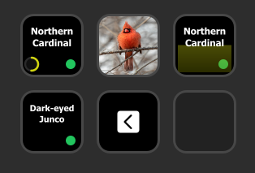
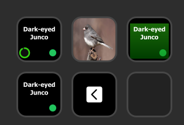

# BirdNET MQTT Stream Deck Plugin

Displays BirdNET detections on Stream Deck keys using MQTT. Actions include:
- Last Detection (circle) - Confidence ring with the latest detection
- Last Detection (meter) - Confidence meter fill for the latest detection
- Last Detection (image) - Image of the latest detected bird
- Today's Birds rotation - Rotates unique species seen today

On information tiles (circle, meter, today's birds), there is a glyph in the bottom right corner to represent rarity. This is configurable and based on the "occurrence" data from BirdNET.
- Green Circle = Common
- Blue Square = Uncommon
- Yellow Diamond = Rare
- Purple Star = Epic

## Screenshots

## Manual installation

1) Close Stream Deck.
2) Copy the plugin folder into:
   `C:\Users\<you>\AppData\Roaming\Elgato\StreamDeck\Plugins\`
3) Ensure the folder name is:
   `com.pillowfresco.birdnetmqtt.sdPlugin`
4) Reopen Stream Deck.
